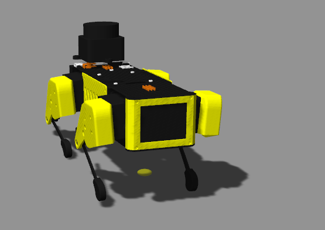
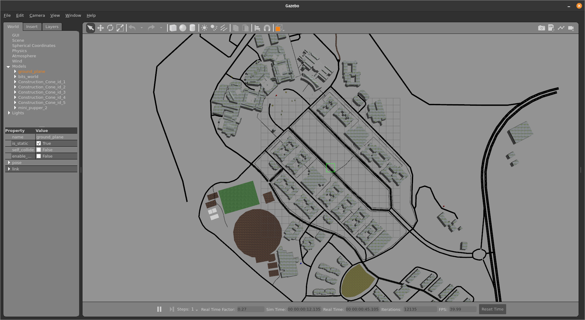
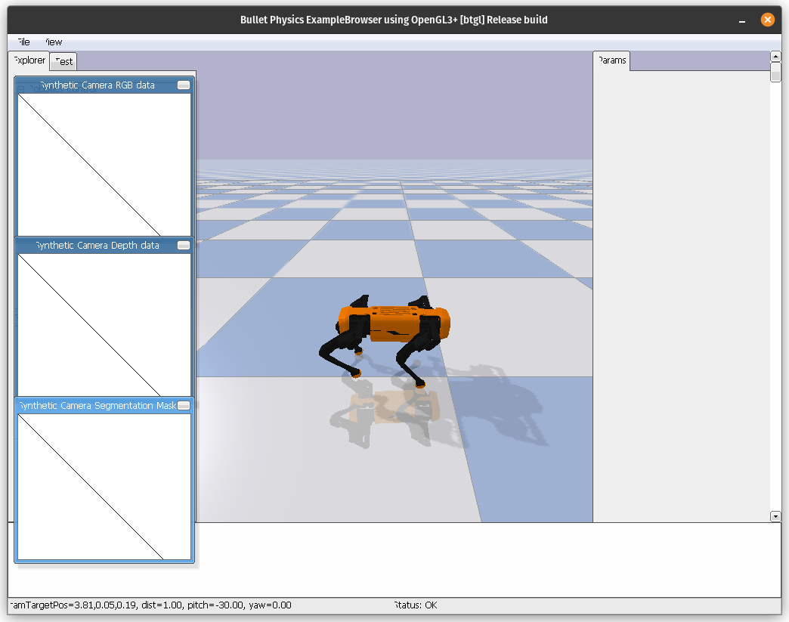
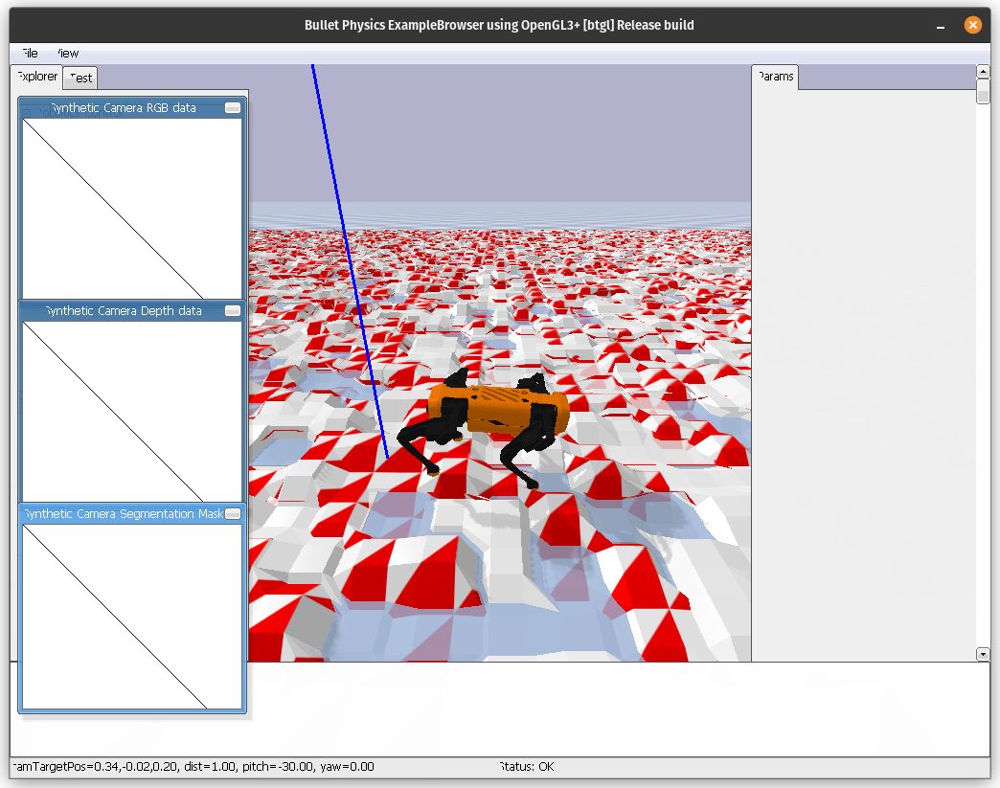

Here are some of the details for the special project for OOP course: Group I

Our project titled "QuadrupedSim" was to develop a ROS2 based Quadruped Simulation on Gazebo. We also further developed a simulator in PyBullet for Reinforcement Learning.

Attached are some images, [presentation](QuadrupedSim%20(OOP%20Final%20Presentation).pdf) and our github repository.

The Gazebo simulation used BITS Goa's Map, which we developed ourselves:

The quadruped spawns in this map with its own controller. We also integrated the SLAM (Simultaneous Localization & Mapping) node from the spot-mini project.

Reinforcement Learning sim:

 | 
Simple Gait Motion | Rough Terrain RL to train different gaits

We also tried to train an RL model for it to learn to handstand (reward in slides), but due to limited time and bad reward functions it didn't work well.

Github Repository for the same (Fully open sourced): https://github.com/vimarsh244/QuadrupedSim

Our future work would include improving performance, better gait patterns, better RL rewards, and more integrated and additional features for the quadruped once we have hardware implementation ready.

Because our team was small, all the members worked equally on the project.

Team Members:
- Vimarsh Shah (2022B5A71060G)
- Nilesh Bhatia (2023A7PS0418G)
- Sudhanshu Kulkarni (2023A7PS0414G)
- Priyanshu Singawat (2023A7PS0417G)
- Kanishk Rai (2023A7PS1026G)

Electronics & Robotics Club